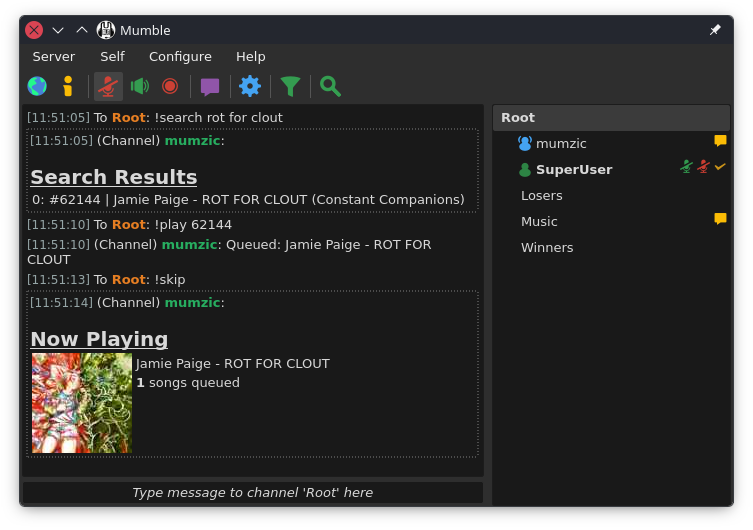

# mumzic
Music Bot for mumble servers, can play youtube/soundcloud or local files.



### Usage / Commands
See [usage.md](https://github.com/iotku/mumzic/blob/master/USAGE.md)

## Stereo Audio
Mumble Client 1.4.x or higher required:


Enable Headphones checkbox in Mumble Client Audio Output settings. 

> [!NOTE]
> For stereo audio to work see the building instructions above which should *hopefully* pull in my modified gumble with stereo output.

## Getting Started

### Server Requirements

For good audio quality you likely want to change the maximum bandwidth of your server to at least 96000 (`bandwidth=96000` in mumble-server (murmur) config).

### Docker Compose

> [!TIP]
> Using Docker Compose will ensure you have the correct dependencies!

Copy `.env-example` -> `.env` and fill out server information and credentials.

```bash
docker compose up 
```

Rebuild the image to upgrade (e.g. after a git pull)

```bash
docker compose up --build
```

> [!NOTE]
>See docker-compose.yml if you want to enable bindings for a local media.db (still needs work for persistance see [#51](https://github.com/iotku/mumzic/issues/51))


## Development
### Dependencies

Base Reqirements: go / ffmpeg / yt-dlp / sqlite3 

Development Headers: opus / opusfile

Build tools: pkg-config


#### 2026 Update:

We now require opus development headers to build with https://github.com/hraban/opus/tree/v2


<details>
<summary>Ubuntu (Debian / Apt Based Distros)</summary>

```sh
sudo apt-get install pkg-config libopus-dev libopusfile-dev
```

</details>

<details>
<summary>Fedora (Rocky Linux / dnf)</summary>

```sh
sudo dnf install opus-devel opusfile-devel pkgconfig
```

</details>

<details>
<summary>Bazzite (Universal Blue / Universal Blue)</summary>

```sh
export PKG_CONFIG_PATH=$(brew --prefix)/lib/pkgconfig:$PKG_CONFIG_PATH
brew install pkg-config opus opusfile
```

</details>

<details>
<summary>MacOS</summary>

```sh
brew install pkg-config opus opusfile
```
</details>

Windows: Consider using Docker or WSL Ubuntu.

## Building 
Until I can figure out modifying modules properly

```bash
git clone https://github.com/iotku/mumzic/`
```

You can `go build` which should pull in my modified gumble which has stereo support

> [!WARNING]
>Using `go get` / `go install` WONT work becasue it does not respect the replace method in go.mod.

## Running

```bash
./mumzic -insecure -server [hostname or ip]`
```

For additional options (such as setting the **username** or **password**), see `mumzic -help`

<details>
<summary>Gumble CLI Flags</summary>

```bash
Usage of ./mumzic:
  -certificate string
        user certificate file (PEM)
  -insecure
        skip server certificate verification
  -key string
        user certificate key file (PEM)
  -password string
        client password
  -server string
        Mumble server address (default "localhost:64738")
  -username string
        client username (default "gumble-bot")
```

</details>

Note: Here we used the `-insecure` flag, to (hopefully) avoid the pain that comes with setting up certificates

>[!WARNING] 
>Currently we don't check for credentials in the `.env` file when running directly outside of docker-compose so we MUST supply the arguments directly to the mumzic executable